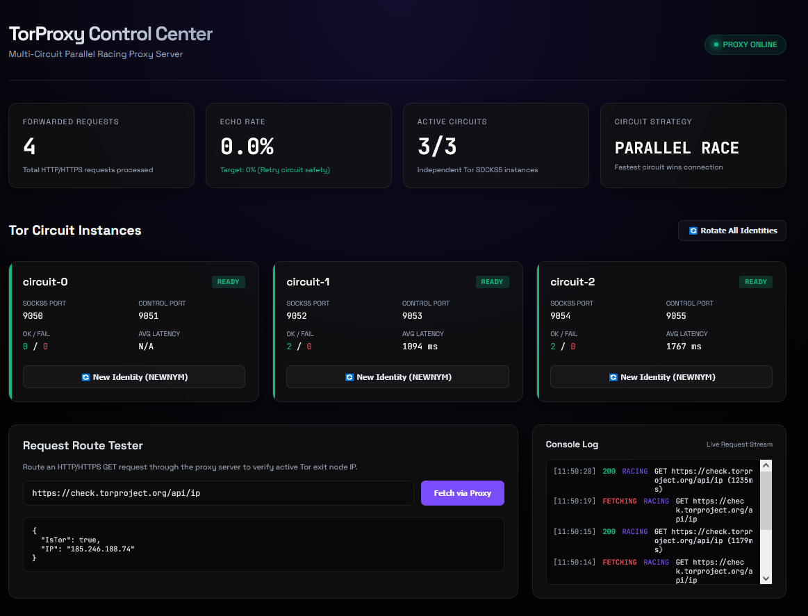

# TorProxy

A multi-circuit parallel-racing Tor proxy server built with Python and asyncio, with a React + Vite dashboard for real-time monitoring and control.

---



## Features

- **Parallel Circuit Racing** — All Tor circuits race each request simultaneously; the fastest response wins
- **Multiple Independent Tor Instances** — Each circuit is a separate `tor` process with its own SOCKS5 and control port
- **Zero-Echo Retry** — Failed circuits are blacklisted per-request; zero repeated failed circuits
- **Circuit Rotation** — Trigger NEWNYM on any individual circuit or all at once via the dashboard or API
- **HTTPS CONNECT Tunnelling** — Full TLS passthrough via asyncio raw TCP tunnelling
- **Stats Endpoint** — Live JSON stats at `/__torproxy__/stats`
- **React Dashboard** — Dark-mode control panel with live circuit health, request log, and route tester

---

## Prerequisites

- **Python ≥ 3.11**
- **Node.js ≥ 18** (for the dashboard frontend only)

---

## Quick Start

### 1. Clone & set up the Python backend

```bash
# Create and activate a virtual environment
python -m venv .venv
.venv\Scripts\activate          # Windows
# source .venv/bin/activate     # macOS / Linux

# Install Python dependencies
pip install -r requirements.txt
```

### 2. Configure environment

Copy the example file and edit as needed:

```bash
copy .env.example .env
```

### 3. Start the proxy

```bash
python main.py
```

Output:

```
INFO  torproxy.server  === TorProxy listening on 0.0.0.0:8080 (circuits=3, race=True) ===

  +-----------------------------------------------+
  |  TorProxy is running                          |
  |  Proxy  : http://0.0.0.0:8080                 |
  |  Stats  : http://127.0.0.1:8080/__torproxy__/stats  |
  |  Press Ctrl+C to stop                         |
  +-----------------------------------------------+
```

### 4. Start the dashboard (optional)

```bash
cd frontend
npm install
npm run dev
```

Open [http://localhost:5173](http://localhost:5173) in your browser.

---

## Using the Proxy

### From a browser / curl

Configure your HTTP client to use `http://127.0.0.1:8080` as the HTTP proxy:

```bash
curl -x http://127.0.0.1:8080 https://check.torproject.org/api/ip
```

### From PowerShell

```powershell
Invoke-WebRequest -Proxy "http://127.0.0.1:8080" -Uri "https://check.torproject.org/api/ip"
```

### From Python

```python
import requests

proxies = {
    "http":  "http://127.0.0.1:8080",
    "https": "http://127.0.0.1:8080",
}
r = requests.get("https://check.torproject.org/api/ip", proxies=proxies)
print(r.json())
```

---

## Configuration

All settings are controlled via environment variables or a `.env` file:

| Variable | Default | Description |
|---|---|---|
| `PROXY_HOST` | `0.0.0.0` | Bind address |
| `PROXY_PORT` | `8080` | Listen port |
| `NUM_CIRCUITS` | `3` | Number of parallel Tor processes |
| `SOCKS_BASE_PORT` | `9050` | First SOCKS5 port (increments by 2 per circuit) |
| `CONTROL_BASE_PORT` | `9051` | First control port (increments by 2 per circuit) |
| `TOR_BINARY` | `tor` | Path to `tor` executable |
| `TOR_DATA_DIR` | `./tor_data` | Base directory for Tor data files |
| `TORRC_TEMPLATE` | `./torrc.template` | Torrc config template path |
| `PARALLEL_RACE` | `true` | `true` = parallel race, `false` = sequential fallback |
| `RETRY_LIMIT` | `5` | Max retry attempts per request |
| `TIMEOUT_SEC` | `30` | Per-attempt timeout in seconds |
| `CONTROL_PASSWORD` | `torproxy_secret` | Tor control port password |
| `LOG_LEVEL` | `INFO` | Python logging level (`DEBUG`, `INFO`, `WARNING`) |
| `STATS_ENDPOINT` | `true` | Enable `/__torproxy__/stats` and `/__torproxy__/rotate` |

---

## API Endpoints

| Method | Path | Description |
|---|---|---|
| `GET` | `/__torproxy__/stats` | JSON stats for all circuits and retry counters |
| `GET` | `/__torproxy__/rotate?index=0` | Rotate identity for circuit 0 (NEWNYM) |
| `GET` | `/__torproxy__/rotate?index=all` | Rotate identity for all circuits |
| `*` | `/*` | Standard HTTP proxy traffic |

---

## Architecture

```
Client Request
     │
     ▼
┌──────────────────────────────────────┐
│        ProxyServer (TCP)             │  ← asyncio.start_server on PROXY_PORT
│  ┌────────────────────────────────┐  │
│  │         Router                 │  │
│  │  ┌─────────────────────────┐   │  │
│  │  │  RetryCoordinator       │   │  │
│  │  │  (zero-echo, blacklist) │   │  │
│  │  └─────────────────────────┘   │  │
│  └────────────────────────────────┘  │
└──────────────────────────────────────┘
     │
     ├─── circuit-0 (SOCKS5 :9050, ctrl :9051) ──▶ Tor Network
     ├─── circuit-1 (SOCKS5 :9052, ctrl :9053) ──▶ Tor Network
     └─── circuit-2 (SOCKS5 :9054, ctrl :9055) ──▶ Tor Network
```

**Parallel Race flow:**
1. Client sends HTTP `GET` or `CONNECT` to port `8080`
2. Router dispatches the request to all `N` circuits concurrently via `asyncio.gather`
3. The fastest successful response is returned to the client
4. Slower in-flight requests are cancelled
5. Any circuit returning a non-2xx or error is blacklisted for that request and retried on remaining circuits

---

## Project Structure

```
TorProxy/
├── main.py                  # Entry point — wires up config, Tor controller, proxy server
├── requirements.txt         # Python dependencies
├── pytest.ini               # Pytest configuration
├── torrc.template           # Tor configuration template (ports injected at runtime)
├── .env.example             # Example environment configuration
├── .env                     # Local environment (git-ignored)
│
├── torproxy/
│   ├── config.py            # Centralised configuration (env-driven)
│   ├── circuit.py           # Circuit state machine (STARTING → READY → DEGRADED → DEAD)
│   ├── tor_controller.py    # Tor process lifecycle + NEWNYM rotation (via stem)
│   ├── retry.py             # Zero-echo retry coordinator + circuit blacklisting
│   ├── router.py            # Parallel race / sequential routing + HTTPS CONNECT tunnel
│   └── server.py            # Async TCP proxy server (HTTP + CONNECT handler)
│
├── frontend/                # React + Vite dashboard
│   └── src/
│       ├── App.tsx          # Dashboard UI (stats, circuit control, route tester)
│       ├── index.css        # Global dark-mode styles
│       └── main.tsx         # React entry point
│
├── tests/
│   ├── test_circuit.py      # Unit tests for circuit state machine
│   └── test_retry.py        # Unit tests for retry / zero-echo logic
│
├── tor_bin/                 # Place your tor binary here (git-ignored)
└── tor_data/                # Runtime Tor data directories (git-ignored)
```

---

## Running Tests

```bash
.venv\Scripts\activate
pytest tests/ -v
```

All 15 tests should pass.

---

## Dashboard

The React dashboard connects to `http://localhost:8080` and provides:

- **Live stats** — refreshed every 2 seconds
- **Circuit cards** — per-circuit SOCKS5/control port, success rate, average latency, ok/fail counters
- **Rotate buttons** — trigger NEWNYM on individual circuits or all at once
- **Request Route Tester** — send a test GET request through the proxy from your browser and see the raw response
- **Console Log** — live stream of recent requests routed through the dashboard tester

---

## License

MIT
